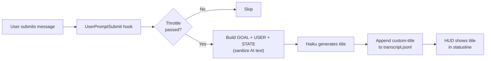

# Claude Live Title

Meaningful Claude Code session titles, updated live as the conversation evolves.

[](LICENSE)
[](https://github.com/macworld/claude-live-title/stargazers)

English | [中文](README_ZH.md)

## Why?

Claude Code assigns random slugs like `elegant-chasing-eich` as session names — meaningless when you `resume` a past session. A title based on the first message helps, but long conversations drift: you start debugging a login bug and end up refactoring the auth middleware. A static title can't keep up.

claude-live-title updates the title as your conversation evolves, so when you browse past sessions or `resume`, the title reflects what the session *actually* became — not just how it started.

If you work with multiple sessions in tmux or split terminals, meaningful titles are even more valuable — glance at any pane and instantly know what each session is working on. Pair with [Claude HUD](#using-with-claude-hud) to show titles right in the statusline.

## Features

- **Live updates** — titles appear during conversation, not just after it ends
- **Context-aware** — anchors on the session's original goal, weighs your latest intent, and falls back to Claude's latest reply for short replies like "continue" / "ok"
- **Multilingual** — auto-detects conversation language, or set manually
- **Smart throttling** — first message triggers immediately, then rate-limited to save API calls
- **Non-blocking** — all hooks run async, never interrupts your workflow
- **Configurable** — model, language, throttle interval, all adjustable
- **Cross-platform** — works on Linux and macOS

## How It Works

The plugin uses two hooks:

1. **UserPromptSubmit (live)** — fires the moment you press Enter on a message, so the title starts generating before Claude even begins responding. By the time Claude finishes, the title is usually already in the transcript and the HUD picks it up on the next render. Throttled to avoid excessive API calls.
2. **Stop (fallback)** — if `UserPromptSubmit` failed or raced past the HUD render, this catches it at the end of Claude's reply.

Titles are generated by calling a lightweight model (Haiku by default) with a three-tier sample of your conversation:

- **`GOAL:`** — the session's very first user message. Anchors the title to the original intent so long sessions don't drift into whatever sub-task Claude is currently working on.
- **`USER:`** — the earliest few and most recent few user messages after the goal (configurable via `contextMessages.head` and `contextMessages.tail`). The last substantive USER message is the primary signal for what the title should describe.
- **`STATE:`** — Claude's latest text reply, sanitized and capped at 300 characters. Treated as background context, not as the subject of the title — **except** when the last USER message is a short filler reply like "ok" / "continue" / "好" / "继续", in which case STATE becomes the intent signal.

Before the AI text reaches Haiku, a sanitize pass strips fenced code blocks, inline backticks, stack frames (Python, JS, Java, Ruby, Rust panics, Go panics, Node `UnhandledPromiseRejection`), and `$` / `>` shell prompt lines. The line-rule catalog lives in `hooks/lib/sanitize-line-rules.tsv` so adding a new noise shape is one row, no code change. If under 30 bytes of substance remain, the `STATE:` line is dropped entirely — this prevents titles from latching onto `Traceback` lines or shell-output fragments when Claude's last paragraph is mostly code or errors.

The sample is passed to Haiku (chosen for speed and cost; configurable via `model`), and the generated title is written to the session transcript as a `custom-title` entry.



## Installation

There are two ways to install. Pick one, then restart Claude Code.

### From the official Anthropic directory (recommended)

Listed in [`claude-plugins-community`](https://github.com/anthropics/claude-plugins-community). The directory syncs in weekly batches, so the version there may be a few days behind this repo.

```
/plugin marketplace add anthropics/claude-plugins-community
/plugin install claude-live-title@claude-plugins-community
```

### From this repo (always latest)

```
/plugin marketplace add macworld/claude-live-title
/plugin install claude-live-title@claude-live-title
```

### Then restart Claude Code

Hooks only register at startup, so a full restart is needed — `/reload-plugins` reloads commands and skills, but not hooks. The plugin works out of the box with zero configuration.

<details>
<summary><strong>Linux: install fails with <code>EXDEV: cross-device link not permitted</code>?</strong></summary>

`/tmp` is on a separate tmpfs filesystem on many Linux setups, which breaks the plugin install. Point TMPDIR at your home directory before launching Claude Code:

```bash
mkdir -p ~/.cache/tmp && TMPDIR=~/.cache/tmp claude
```

Then run the install commands inside that session.

</details>

## Configuration

Configuration is optional. All settings have sensible defaults.

Use the slash command to configure interactively:

```
/claude-live-title:config
```

Or edit the config file directly:

```
~/.claude/plugins/data/claude-live-title/config.json
```

```jsonc
{
  // Model for title generation (default: "haiku")
  "model": "haiku",

  // Title language: "auto" detects from conversation (default: "auto")
  // Set to "zh", "en", "ja", "ko", etc. for a specific language
  "language": "auto",

  // Target title length in display columns, passed to the AI prompt (default: 30)
  // CJK characters count as 2 columns, Latin as 1
  "maxLength": 30,

  // Number of user messages sampled for title generation
  "contextMessages": {
    "head": 3,  // earliest messages (default: 3)
    "tail": 5   // most recent messages (default: 5)
  },

  // Min seconds between live updates (default: 240)
  "throttleInterval": 240,

  // Min new messages before live update (default: 2)
  "throttleMessages": 2,

  // Enable real-time updates (default: true)
  // Set to false to only generate titles when session ends
  "liveUpdate": true,

  // Enable debug logging (default: false)
  "debug": false
}
```

### Language Setting

By default (`"auto"`), the plugin detects the language of your conversation and generates titles in the same language. This works well for most single-language conversations.

If you always want titles in a specific language regardless of conversation language, set it explicitly:

```json
{
  "language": "en"
}
```

> **Note:** In mixed-language conversations (e.g., task descriptions in one language with code and error messages in English), auto-detection may occasionally pick the wrong language. If consistent title language is important to you, set it explicitly.

## Using with Claude HUD

[claude-live-title](https://github.com/macworld/claude-live-title) works seamlessly with [Claude HUD](https://github.com/jarrodwatts/claude-hud). Titles generated by this plugin are automatically displayed in the HUD statusline.

### Setup

1. Install both plugins:

   ```
   /plugin marketplace add macworld/claude-live-title
   /plugin install claude-live-title
   /plugin marketplace add jarrodwatts/claude-hud
   /plugin install claude-hud
   ```

2. Enable session name display in HUD (disabled by default):

   ```
   /claude-hud:configure
   ```

   Set `showSessionName` to `true`. Or edit the config manually:

   ```json
   // ~/.claude/plugins/claude-hud/config.json
   {
     "display": {
       "showSessionName": true
     }
   }
   ```

3. Start a new conversation — the title will appear in your statusline after your first message and update as the conversation evolves.

### How It Integrates

claude-live-title writes `custom-title` entries to the session transcript file. Claude HUD reads these entries and displays the latest title in the statusline, replacing the default random slug. The title updates in real-time as your conversation progresses.

## Requirements

- Claude Code 2.1.x or later
- `jq` (JSON processor) — pre-installed on most systems, or install via your package manager
- Linux or macOS (Windows users need Git Bash or WSL)

## Troubleshooting

**Titles not appearing?**
1. Check that the plugin is installed and enabled: look for `claude-live-title` in your enabled plugins
2. Enable debug logging: set `"debug": true` in your config
3. Check the debug log: `cat /tmp/claude-live-title-debug.log`

**Titles in wrong language?**
Set the language explicitly in your config rather than relying on auto-detection.

**Too many / too few updates?**
Adjust `throttleInterval` (seconds) and `throttleMessages` (message count) in your config.

**Caught a bad title? Help improve it.**
With `"debug": true`, every generated title appends a structured event to `/tmp/claude-live-title-debug.log` capturing the dialog Haiku actually saw. After hitting a bad title, run `bin/promote-fixture.sh <slug>` to capture that exact dialog as a regression fixture under `tests/fixtures/transcripts/` — file an issue or PR with it and we can iterate on the prompt or sanitize rules with concrete repros.

## Development

```bash
git clone https://github.com/macworld/claude-live-title
cd claude-live-title

# Load plugin from source for development
claude --plugin-dir .
```

For local development, `--plugin-dir` loads the plugin directly from your working copy — no install or cache involved. Hook changes require a session restart; use `/reload-plugins` for command/skill changes.

## More

- [Changelog](CHANGELOG.md) — release notes and version history
- [Privacy Policy](PRIVACY.md) — what runs locally and what doesn't leave your machine

## License

MIT
