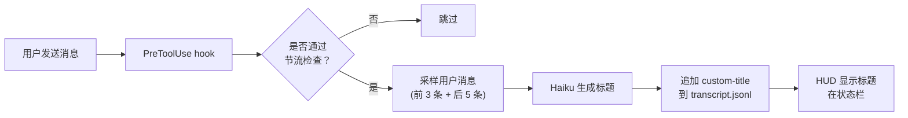

# Claude Live Title

为 Claude Code 自动生成有意义的标题，随对话推进动态更新。

[](LICENSE)
[](https://github.com/macworld/claude-live-title/stargazers)

[English](README.md) | 中文

## 为什么需要它？

Claude Code 默认用随机 slug（如 `elegant-chasing-eich`）作为会话名 — 当你 `resume` 回顾历史会话时，完全看不出当时在做什么。即使根据第一条消息生成标题也不够：长对话中话题会漂移，你可能从修复登录 Bug 聊到了重构认证模块，但标题还停留在最初的话题上。

claude-live-title 会随对话演进持续更新标题，让你在浏览历史会话或 `resume` 时，看到的是会话 **最终的实际内容**，而不只是开头的话题。

如果你习惯用 tmux 或多终端窗口同时开多个会话，有意义的标题更加关键 — 切到任意窗口就能一眼看出这个会话在做什么。搭配 [Claude HUD](#配合-claude-hud-使用) 可以直接在状态栏显示标题。

## 特性

- **实时更新** — 标题在对话过程中就会出现，而不是等对话结束
- **多语言支持** — 自动检测对话语言，也可手动设置
- **智能节流** — 首条消息立即触发，之后按频率限制更新，节省 API 调用
- **不阻塞** — 所有 hook 异步运行，不会打断你的工作流
- **可配置** — 模型、语言、节流间隔等均可调整
- **跨平台** — 支持 Linux 和 macOS

## 工作原理

插件使用两个 hook：

1. **PreToolUse（实时）** — 在你发送第一条消息后立即生成标题，之后随对话演进周期性更新（有节流机制，避免过多 API 调用）
2. **Stop（兜底）** — 如果会话期间未生成标题，在会话结束时补充生成

标题由轻量模型（默认 Haiku）根据对话消息样本生成——取最早的几条和最近的几条用户消息（可通过 `contextMessages.head` 和 `contextMessages.tail` 分别调整），写入会话 transcript 文件作为 `custom-title` 记录。



## 安装

在 Claude Code 会话中执行：

**第 1 步：添加插件源**
```
/plugin marketplace add macworld/claude-live-title
```

**第 2 步：安装插件**

<details>
<summary><strong>⚠️ Linux 用户请先看这里</strong></summary>

Linux 上 `/tmp` 通常是独立的 tmpfs 文件系统，可能导致安装失败：
```
EXDEV: cross-device link not permitted
```

**解决方法**：安装前设置 TMPDIR：
```bash
mkdir -p ~/.cache/tmp && TMPDIR=~/.cache/tmp claude
```

然后在该会话中执行下面的安装命令。

</details>

```
/plugin install claude-live-title
```

**第 3 步：重载并重启**
```
/reload-plugins
```

重启 Claude Code 以激活 hook。插件开箱即用，无需任何配置。

## 配置

配置完全可选，所有设置都有合理的默认值。

使用斜杠命令交互式配置：

```
/claude-live-title:config
```

或直接编辑配置文件：

```
~/.claude/plugins/data/claude-live-title/config.json
```

```jsonc
{
  // 标题生成模型（默认："haiku"）
  "model": "haiku",

  // 标题语言："auto" 自动检测对话语言（默认："auto"）
  // 可设为 "zh"、"en"、"ja"、"ko" 等指定语言
  "language": "auto",

  // 目标标题显示列宽，传给 AI 的 prompt 参数（默认：30）
  // CJK 字符算 2 列，拉丁字符算 1 列
  "maxLength": 30,

  // 用于生成标题的用户消息采样数
  "contextMessages": {
    "head": 3,  // 最早的几条消息（默认：3）
    "tail": 5   // 最近的几条消息（默认：5）
  },

  // 实时更新最小间隔秒数（默认：240）
  "throttleInterval": 240,

  // 实时更新最少新消息数（默认：2）
  "throttleMessages": 2,

  // 启用实时更新（默认：true）
  // 设为 false 则仅在会话结束时生成标题
  "liveUpdate": true,

  // 启用调试日志（默认：false）
  "debug": false
}
```

### 语言设置

默认情况下（`"auto"`），插件会自动检测对话语言并生成对应语言的标题。对于单一语言的对话效果很好。

如果你用英文和 Claude 交流，但希望标题用中文，可以明确设置：

```json
{
  "language": "zh"
}
```

> **提示：** 在混合语言对话中（如中文描述任务但包含大量英文代码），自动检测偶尔可能选错语言。如果你对标题语言一致性有要求，建议手动设置。

## 配合 Claude HUD 使用

[claude-live-title](https://github.com/macworld/claude-live-title) 可与 [Claude HUD](https://github.com/jarrodwatts/claude-hud) 无缝配合。生成的标题会自动显示在 HUD 状态栏中。

### 设置步骤

1. 安装两个插件：

   ```
   /plugin marketplace add macworld/claude-live-title
   /plugin install claude-live-title
   /plugin marketplace add jarrodwatts/claude-hud
   /plugin install claude-hud
   ```

2. 在 HUD 中启用会话名称显示（默认关闭）：

   ```
   /claude-hud:configure
   ```

   将 `showSessionName` 设为 `true`。或手动编辑配置：

   ```json
   // ~/.claude/plugins/claude-hud/config.json
   {
     "display": {
       "showSessionName": true
     }
   }
   ```

3. 开始新对话 — 发送第一条消息后，标题就会出现在状态栏中，并随对话演进实时更新。

### 集成原理

claude-live-title 将 `custom-title` 记录写入会话 transcript 文件。Claude HUD 读取这些记录并在状态栏显示最新标题，替代默认的随机 slug。标题会随对话推进实时更新。

## 系统要求

- Claude Code 2.1.x 或更高版本
- `jq`（JSON 处理器）— 大多数系统已预装，或通过包管理器安装
- Linux 或 macOS（Windows 用户需要 Git Bash 或 WSL）

## 常见问题

**标题没有出现？**
1. 确认插件已安装并启用：在已启用插件列表中查找 `claude-live-title`
2. 开启调试日志：在配置中设置 `"debug": true`
3. 查看调试日志：`cat /tmp/claude-live-title-debug.log`

**标题语言不对？**
在配置中明确设置语言，不要依赖自动检测。

**更新太频繁或太少？**
调整配置中的 `throttleInterval`（秒）和 `throttleMessages`（消息数）。

## 开发

```bash
git clone https://github.com/macworld/claude-live-title
cd claude-live-title

# 从源码目录加载插件进行开发
claude --plugin-dir .
```

本地开发时，`--plugin-dir` 直接从工作目录加载插件，无需安装或缓存。修改 hook 需要重启会话；修改 command/skill 可用 `/reload-plugins` 热重载。

## 许可证

MIT
